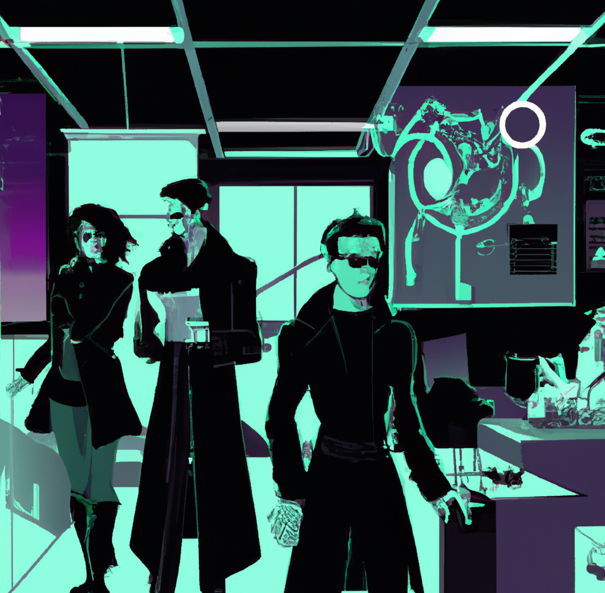

<!--more-->

## About BUCHI

BUCHI is a world-leading supplier of laboratory technology solutions for research and development, quality assurance, and production for various industries, including pharmaceuticals, chemicals, food & feed, beverage, environmental analysis, and academia.

What started as a craftsman’s workshop over 80 years ago has grown into a global glass, mechatronics, and technology company offering fully automated laboratory technology solutions, proprietary software, and application expertise.

#### Becoming a data-driven company

As companies are increasingly becoming data-driven, the demand for AI technology grows. AI technology enables enterprises to get insights to optimize operations and make more informed decisions.

We aim to build the most advanced data analytics ecosystem for laboratory devices and digital services offered by BUCHI to scale business growth. To achieve this goal, we are focusing on making BUCHI services, instruments and processes smarter and more efficient through sustainable and pragmatic data-driven solutions.

### The Data Science team

<!---->

<!---->



We develop calibration models for NIR spectroscopy, automation tools, APIs and integrations that support business efficiency and processes at BUCHI.

We succeed when our team amplifies the work of other teams, understand their pain points and concerns around data, and develop data products that provide universal value to employees across departments, roles, tenure, and data literacy levels.

### Our mission

* Serving as data experts and advocates during both strategic planning and day-to-day operations.
* Generating data-based guidance and recommendations that grow our business.
* Providing useful metrics, insights, predictions, and analytic tools.

#### Going further

We created this blog to become a place for Scientist and Engineers to meet, learn, improve, and share knowledge.

When commenting or taking part in conversations, don't be afraid of judgement or scrutiny. We all understand it's impossible to know everything. Just be sure to stick to our Code of Conduct.

Meet the team [here]().

---

### Code of conduct
The Data Science team adheres to the [Contributor Covenant Code of Conduct](https://www.contributor-covenant.org/version/2/1/code_of_conduct/). By contributing to our public repositories and commenting on the blog posts, you are expected to uphold this code.